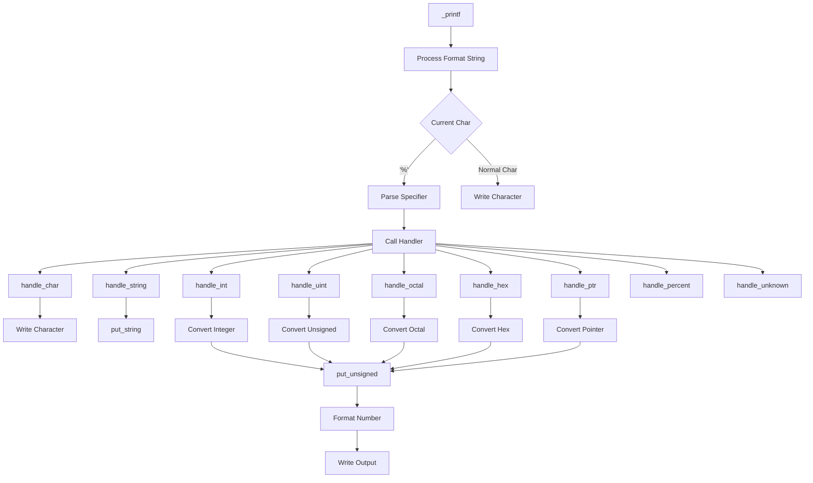

# holbertonschool-printf

# Custom `_printf` Implementation

## Overview
This project implements a custom `_printf` function that mimics the behavior of the standard C library `printf` function. It supports various format specifiers to handle different data types and includes robust error handling.

## Table of Contents
- [Supported Format Specifiers](#supported-format-specifiers)
- [System Architecture](#system-architecture)
- [Key Features](#key-features)
- [File Structure](#file-structure)
- [Compilation](#compilation)
- [Usage Example](#usage-example)
- [Output Handling](#output-handling)
- [Error Handling](#error-handling)
- [Limitations](#limitations)

## Supported Format Specifiers
| Specifier | Description                | Handler Function      |
|-----------|----------------------------|-----------------------|
| `%c`      | Single character           | `handle_char`        |
| `%s`      | String                     | `handle_string`      |
| `%d`, `%i`| Signed integer             | `handle_int`         |
| `%u`      | Unsigned integer           | `handle_uint`        |
| `%o`      | Octal number               | `handle_octal`       |
| `%x`      | Hexadecimal (lowercase)    | `handle_hex_lower`   |
| `%X`      | Hexadecimal (uppercase)    | `handle_hex_upper`   |
| `%p`      | Pointer address            | `handle_ptr`         |
| `%%`      | Percent sign               | `handle_percent`     |

## System Architecture


## Key Features

1. Comprehensive Type Handling: Supports characters, strings, integers, unsigned integers, pointers, and more

2. Base Conversion: Handles decimal, octal, and hexadecimal outputs with case control

3. Robust Error Handling: Returns -1 immediately on any write failure

4. Edge Case Management:

- Handles INT_MIN correctly

- Prints (null) for NULL strings

- Processes trailing % characters properly

5. Memory Safety: Uses stack buffers instead of dynamic allocation

6. Extensible Architecture: Easy to add new specifiers via handler table

7. Modular Design: Separated concerns with clear file responsibilities

## File Structure
## File Structure

| File              | Description                          | Key Functions                        |
|-------------------|--------------------------------------|--------------------------------------|
| `main.h`          | Header file with prototypes/structs  | Type definitions, function decls     |
| `_printf.c`       | Main printf implementation           | `_printf()`, format processing       |
| `num_handlers.c`  | Handles numeric specifiers           | `handle_int()`, `handle_uint()`      |
| `string_handlers.c` | Handles char/string/hex specifiers | `handle_char()`, `handle_string()`   |
| `utils.c`         | Core conversion/write utilities      | `put_unsigned()`, `put_string()`     |
| `_putchar.c`      | Character output function            | `_putchar()`                         |


## Compilation

Compile all source files with the following command:

```bash
gcc -Wall -Werror -Wextra -pedantic *.c -o printf_program
```
Run the compiled program:
```bash
./printf_program
```

## Usage Example

```c
#include "main.h"

int main(void) {
    int count = _printf("String: %s\nChar: %c\nInt: %d\nHex: %x\nPtr: %p\n", 
                        "Hello", 'A', -42, 255, &main);
    
    _printf("\nPrinted %d characters\n", count);
    return 0;
}
```
Sample Output:

```text
String: Hello
Char: A
Int: -42
Hex: ff
Ptr: 0x40057d
Printed 52 characters
```

## Output Handling

- **Characters:** Directly written using `write()` system call

- **Strings:** Printed with length calculation, handles NULL as `(null)`

- **Integers:** Converted using arithmetic operations

- **Unsigned Numbers:** Processed through `put_unsigned()`

- **Hex/Octal:** Converted using modular arithmetic

- **Pointers:** Prefixed with "0x" and printed as hex

- **Unknown Specifiers:** Printed as `%` + character

## Error Handling

- Returns `-1` immediately on any write failure
- Maintains character count until error occurs
- Safely handles invalid specifiers
- Handles edge cases like `INT_MIN` correctly

## Limitations

1. ❌ No floating point support (`%f`, `%F`)

2. ❌ No width/precision modifiers (e.g., `%5d`, `%.2f`)

3. ❌ No flag handling (`+`,` `, `#`, `0`, `-`)

4. ❌ No locale-specific formatting

5. ❌ No length modifiers (`l`, `h`, `ll`)

6. ❌ No custom formatting options

This implementation provides a solid foundation for format string processing with extensible architecture for future enhancements. The modular design makes it easy to add new format specifiers by extending the handler table in `utils.c`.